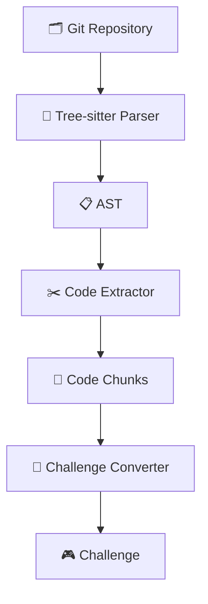
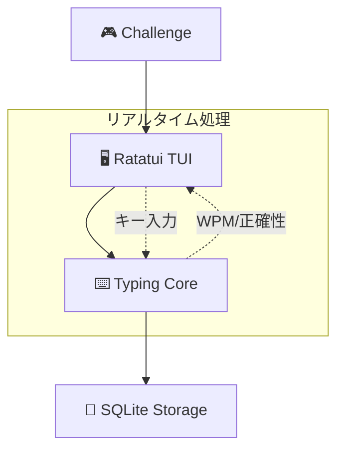

> コードを素材にしたOSSのTUIタイピングゲーム **GitType** を作った。この記事では「どんな仕組みか」をまとめる。

https://github.com/unhappychoice/gittype

## どういうゲームか


## 全体アーキテクチャ

GitType の構成は次の通り。

**問題生成フロー**



**ゲームプレイフロー**



## AST とコード片切り出し（Tree-sitter）

GitType は **[Tree-sitter](https://github.com/tree-sitter/tree-sitter)** を使ってソースコードを構造的に解析し、意味のある単位でコード片を抽出する。

### 抽出の仕組み

#### 1. パーサーレジストリによる言語管理  
各言語専用の `LanguageExtractor` とTree-sitterパーサーを事前に登録。言語固有のクエリパターンと抽出ロジックを一元管理。
   
https://github.com/unhappychoice/gittype/blob/4950eee/src/extractor/parsers/mod.rs#L40-L147

#### 2. AST構築とクエリ実行  
ソースファイルをTree-sitterでパースしてAST（抽象構文木）を構築。言語固有のクエリを使って関数、クラス、メソッドなどの構文要素を検索。
   
https://github.com/unhappychoice/gittype/blob/4950eee/src/extractor/core/extractor.rs#L36-L60

#### 3. 構造的なチャンク生成  
クエリ結果から `CodeChunk` を生成。ノードの開始・終了位置を使って、構文境界を尊重した形でコード片を切り出し。
   
https://github.com/unhappychoice/gittype/blob/4950eee/src/extractor/code_chunk_extractor.rs#L15-L45

#### 4. 難易度に応じたサイズ調整  
抽出したチャンクを難易度設定に合わせて調整。単純な文字数カットではなく、改行や構造の区切りを考慮してスライス。

* EASY: 約 100 文字
* NORMAL: 約 200 文字
* HARD: 約 500 文字
   
https://github.com/unhappychoice/gittype/blob/4950eee/src/extractor/challenge_converter.rs#L181-L210

単純な文字数ベースではなく、構文境界を尊重することで意味のある単位でのコード片抽出を実現。

### 切り出し方

* 先頭から固定長ではなく、**改行や構造の区切り**を探してスライス
* 「中抜き」などの加工はまだ未実装で、シンプルに先頭から切り出すのみ

## TUI（Ratatui）

GitType の TUI は **[Ratatui](https://github.com/ratatui-org/ratatui)** と独自の **ScreenManager** を組み合わせて実装。

### アーキテクチャ

#### 1. 中央集権的なScreenManager
スクリーン管理、描画ループ、入力ハンドリングを一元管理。

https://github.com/unhappychoice/gittype/blob/4950eee/src/game/screen_manager.rs#L41-L55

#### 2. 二重テキスト管理のTypingCore
タイピング用と表示用の2つのテキストを分離管理し、リアルタイムな入力処理を実現。

https://github.com/unhappychoice/gittype/blob/4950eee/src/game/typing_core.rs#L4-L22

**実装で苦労した点：**

- **バイト⇄文字位置の座標変換**: Tree-sitterはバイト単位でコメント位置を返すため、文字単位のタイピング処理との間で座標変換が必要。特にマルチバイト文字が含まれる場合の変換処理が複雑。

https://github.com/unhappychoice/gittype/blob/4950eee/src/game/typing_core.rs#L55-L100

- **改行文字の可視化**: コードのタイピングでは改行やスペースが重要だが通常は見えない。表示用テキストでは記号化し、タイピング用テキストでは実際の文字として扱う必要性。

- **コメント範囲の同期**: タイピング対象からコメントを除去する際、元テキストと加工後テキスト間の位置マッピングを維持する必要性。リアルタイム処理との整合性確保が課題。

https://github.com/unhappychoice/gittype/blob/4950eee/src/game/text_processor.rs#L25-L50

#### 3. スタックベースの画面遷移
複数の画面やダイアログを重ねて表示可能な柔軟な画面管理システム。

### 課題

現在の実装では独自のスクリーン管理システムを構築しているが、**[veeso/tui-realm](https://github.com/veeso/tui-realm)** を使用すればより洗練されたコンポーネントベースの実装が可能だったかもしれない。tui-realmはReact風のコンポーネントシステムを提供し、状態管理や再描画の最適化が組み込み済み。

## データベース（SQLite）

プレイデータの永続化には **[SQLite](https://www.sqlite.org/)** を使用。

### 構成

- **Database**: SQLiteコネクション管理とマイグレーション実行
- **DAO/Repository**: データアクセス層の抽象化
- **Migration**: スキーマバージョン管理

https://github.com/unhappychoice/gittype/blob/4950eee/src/storage/database.rs#L7-L25

### 保存データ

ゲームセッション、スコア、統計情報を記録し、履歴画面や分析画面で過去の成績を閲覧可能。データベースは `~/.local/share/gittype/` 配下に配置され、マイグレーション機能によってスキーマの更新にも対応。

## おまけ：使ってみてください

技術解説は以上で、よろしければ実際に試してみてほしいです。

### インストール

* **ワンライナー**

```bash
curl -sSL https://raw.githubusercontent.com/unhappychoice/gittype/main/install.sh | bash
```
* **Homebrew**

```bash
brew install unhappychoice/tap/gittype
```
* **Cargo**

```bash
cargo install gittype
```

### クイックスタート

```bash
# カレントディレクトリを題材に
gittype

# 任意のリポジトリを指定
gittype /path/to/repo

# GitHub 上の OSS を題材に
gittype --repo clap-rs/clap
gittype --repo https://github.com/ratatui-org/ratatui
```

## なぜ作ったのか

**[typing.io](https://typing.io/)** などの類似サービスは固定の問題セットか、自分でアップロードして管理する必要があり少し不便でした。
これは恐らく、動的にコードを解析して意味のある問題を生成するのが技術的に困難だからかもしれません。

GitType では [Tree-sitter](https://github.com/tree-sitter/tree-sitter) による AST 解析を使って、ローカルリポジトリや GitHub 上の OSS を直接題材に可能で、常に"自分が触っているコード"を素材に遊べるのが特徴です。

あなたは10000点超えられますか？
