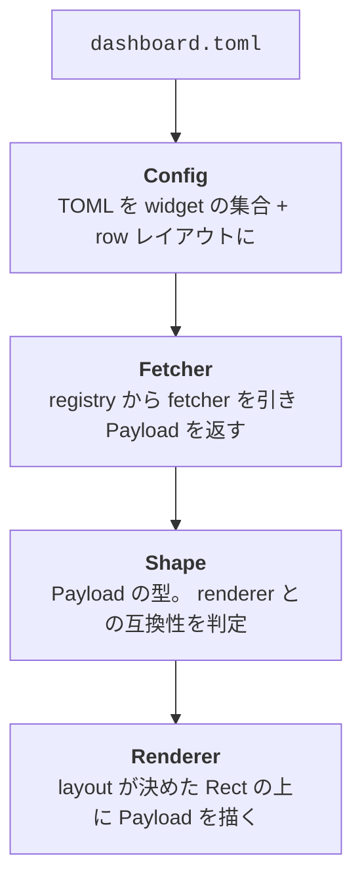

ここからが Part 3 です。 splashboard の中で、シェルを開いてから splash が出るまで何が起きているかを掘ります。

知らなくても splash は組めますが、

- なぜこの fetcher と renderer は組めないのか
- なぜ初回はキャッシュから出るのか
- trust モデルがいる理由は何か

の答えがここで揃います。最初の章はデータの旅、 dashboard.toml に書いた内容が画面のピクセルになるまでの 4 段パイプラインです。

## 4 段のパイプライン

splashboard の中は、長く見えて実は 4 段だけです。



ここから 1 段ずつ追います。

## 段 1: Config

splashboard を起動すると、最初に

- 全 dashboard 共通の `$HOME/.splashboard/settings.toml`
- いまのコンテキストに該当する `*.dashboard.toml` ( per-repo / project / home から 1 つ )

を読みます。 dashboard ファイルからは widget の集合と row レイアウトの 2 つが取れて、 Config という 1 つのデータ構造になります。

```text
[Config]
├── settings        // theme / padding / トグル
└── dashboard
    ├── widgets[]   // id / fetcher 名 / render 指定 / options
    └── rows[]      // height / child の並び / border / title
```

ここまでが文字列としての TOML と、型を持ったデータ構造の境目です。 fetcher も renderer もまだ呼ばれていません。

## 段 2: Fetcher

Config の `widgets[]` を見ながら、各 widget に対して fetcher を 1 つ呼びます。

```text
widget { fetcher = "git_status" }
              │
              ▼
        Registry.get("git_status") ──▶ Box<dyn Fetcher>
              │
              ▼
        FetchContext { widget_id, options, shape, timeout, ... }
              │
              ▼
        fetcher.fetch(ctx).await ──▶ Payload { body, status, refreshed_at }
```

`Registry` は起動時に全 fetcher 名 → 実体のマップを 1 つ持っていて、 widget の `fetcher = "..."` 文字列でそこから引きます。

呼ばれる側の fetcher には 2 系統あります。

- **Realtime**: その場で計算 / 取得 ( `clock` 、 `system_info_*` 、 `git_*` ) 。即時に Payload を返す
- **Cached**: API などコストの高いもの ( `github_*` 、 `weather` ) 。 cache backend が間に入り、キャッシュが新しければそれを返し、古ければバックグラウンドで取り直す

`FetchContext` には widget の `id` 、 `options` ( fetcher 固有の引数 ) 、 `shape` ( renderer が要求した型のヒント ) 、 `timeout` などが詰まっています。 fetcher が何種類もの shape に対応している場合、今回はどの shape を返すべきかがここで決まります。

## 段 3: Shape

`Payload` の中身を覗くと、こんな形をしています。

```rust
pub struct Payload {
    pub body: Body,             // shape ごとに違うデータ本体
    pub status: Status,         // ok / warn / error / loading
    pub refreshed_at: SystemTime,
    // ...
}

pub enum Body {
    Text(...),
    TextBlock(...),
    MarkdownTextBlock(...),
    LinkedTextBlock(...),
    ImageLinkedList(...),
    Entries(...),
    Ratio(...),
    NumberSeries(...),
    PointSeries(...),
    Bars(...),
    Image(...),
    Calendar(...),
    Heatmap(...),
    Badge(...),
    Timeline(...),
}
```

ここが fetcher と renderer の契約点です。

- 各 fetcher は、自分はどの shape を出せるかを `shapes()` で宣言する
- 各 renderer は、自分はどの shape を受け付けるかを `accepts()` で宣言する
- splashboard はその交差を見て、互換であれば Payload をそのまま renderer に渡し、互換でなければプレースホルダ ( shape 不一致 ) を描く

つまり、 fetcher の出力 shape ∈ renderer の accepts が成り立つかどうか、それだけのチェックです。 [reference matrix](https://splashboard.unhappychoice.com/reference/matrix/) の表は、この互換性の交差を表にしたものです。

shape を抽象として挟むメリットは大きいです。

- fetcher を増やしても renderer 側を書き換えなくていい ( shape さえ正しく出せば既存の renderer 全部が使える )
- renderer を増やしても fetcher 側を書き換えなくていい ( ある shape を受け付ければ既存の fetcher 全部から描ける )

100+ fetcher × 30+ renderer のような組み合わせ爆発を、 shape の直積に縮めることで管理可能にしています。

## 段 4: Renderer

最後の段で、 row / child の階層から各 widget の Rect ( x, y, width, height ) が計算されます。

```text
[[row]] height = 8        ──┐
  [[row.child]] width = 30 ─┼── (x=0, y=0, w=30, h=8) ─┐
  [[row.child]] width =fill ┘── (x=30, y=0, w=W-30, h=8)│
                                                          │
[[row]] height = 4                                        │
  [[row.child]] widget = "feed"  ── (x=0, y=8, w=W, h=4) ──┘
                                                          │
                                          ┌───────────────┘
                                          ▼
                                  Renderer.render(payload, rect, frame)
```

renderer は ratatui の `Frame` という buffer に直接書き込みます。例えば `text_ascii` なら figlet 化した文字列をそのまま `Paragraph` として置き、 `grid_heatmap` ならセル 1 つずつ `Block` の塗りで描いていきます。

`Frame` への書き込みが全 widget 分終わったところで、 ratatui がそれをターミナルに 1 度に flush して、 splash が画面に出ます。

## なぜこの分け方か

最初から分かれていたわけではなく、機能を追加するたびに引き直された境界です。今のところ、

- **Config 段**: ユーザーの入力 ( TOML ) を信用していい型に直すだけの責務
- **Fetcher 段**: 外との通信 / I/O が起きるかもしれない場所を 1 箇所にまとめる
- **Shape 段**: fetcher と renderer の組み合わせ爆発を直積に潰す契約
- **Renderer 段**: 描画の仕方だけを考えればよい場所

という分業になっています。次の章では、この中でも fetcher 段の外との I/O をシェル起動時にどう速くしているか ( cache + daemon ) を掘ります。
