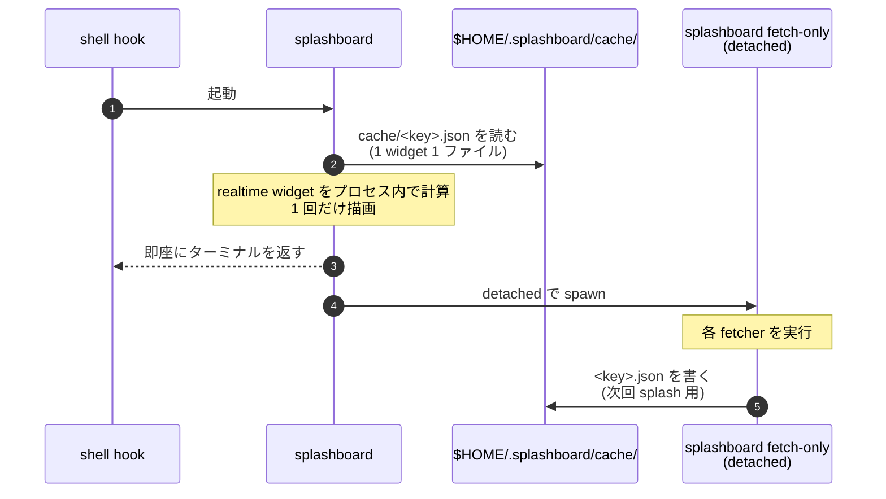

splashboard はシェル起動と `cd` のたびに走るツールです。ほぼ気付かないくらい速いというのが守るべき体感の閾値で、これを満たすために 2 プロセス + ディスクキャッシュという割り切った設計を採用しています。

この章は、 splashboard の中でいちばん設計の意図が露骨に出ている部分です。

## なぜ即座に描けるのか

シェルの hook から呼ばれた `splashboard` のホットパスは、意識的にとても薄く作られています。



ここにネットワーク / git / 重い I/O が一切ないのがポイントです。 splash はキャッシュに今ある値をそのまま描いて即座にシェルへ戻ります。古い値であろうが、エントリが欠けていようが ( ローディング表示が入る ) 、待ちません。

実際の取得は、デタッチドで spawn した子プロセスがやり、次回 splash がそれを読み込みます。これが cached-first モデルです。

## fetch-only によるバックグラウンド refresh

デタッチドの子プロセスは `splashboard fetch-only` という同じバイナリのサブコマンドで、 splash と同じ fetcher registry を使います。やることは 4 つだけです。

1. 同じ dashboard を再解決する: 親から `--kind` / `--path` で渡されるので、 spawn 後に CWD が変わってもズレない
2. per-widget lock を取る: `$HOME/.splashboard/cache/<key>.lock` を `O_CREATE | O_EXCL` で作る。既に誰かが持っていれば、その widget はスキップ ( 他のプロセスが書き終えるのを待つ )
3. `fetch(ctx)` を呼ぶ: fetcher ごとの timeout 付き
4. `<key>.json` をアトミックに書く ( tmp ファイル + `rename` ) 、 lock を外す

lock は refresh の重複を防ぐ仕掛けです。同じタイミングで 2 つ shell が立ち上がっても、 widget ごとに走る fetch は 1 回だけ。もう片方は次の splash でその結果を読みます。古い lock ( 30 秒以上残っているもの ) は孤児として扱い、奪って取り直します。

## stale-while-revalidate

splash は TTL が切れていてもキャッシュをそのまま描きます。古い値が出ること自体は咎められません。先ほど見たのと同じデータというのは、 ambient な splash としてはむしろ自然な挙動です。

期限切れエントリは、次の `fetch-only` が走ったときに refresh されるという意味でしかなく、 splash の流れを止める材料にはなりません。

キャッシュエントリそのものが存在しない場合 ( 初回起動 / `cache clear` 後 / 設定変更でキャッシュキーが変わった後 ) だけ、 widget は loading プレースホルダで塗られます。

- widget が 1 つだけ未取得なら、 splash 全体で最大 2 秒待つ
- 全 widget が cold なら、最大 5 秒待つ

待ち時間内に取得が間に合えば描画され、間に合わなければ loading が残ります。次回 splash でそれが本物のデータに切り替わります。

## エラーとタイムアウトもキャッシュされる

`fetch` が失敗したケースも実はキャッシュに残ります。 cache エントリには `kind` が入っていて、 3 種類区別されます。

| kind | 何が起きたか | TTL | body |
| --- | --- | --- | --- |
| `ok` | fetch が成功 | widget の設定 TTL | 取得した payload |
| `err` | fetch が `Err(_)` を返した | 30 秒 | `⚠ <error>` プレースホルダ |
| `timeout` | per-fetch deadline 超過 | 30 秒 | `⏱ timed out` プレースホルダ |

エラーに短い 30 秒 TTL が設定されているのは絶妙な設計です。

- 一時的な失敗 ( 接続断 / 認証一時失敗 ) は 30 秒後に自動リトライされる
- 慢性的に壊れている widget は、毎 splash で叩きに行く動作を **しない** ( 30 秒は再度キャッシュから読まれる )
- エラー表示はその widget のスロット内で出るので、 splash 全体が止まらず、何が壊れているかが見える

splash がいきなり crash しない、エラーが見えなくならない、それでいて壊れた API を毎回叩きには行かない。 3 つを同時に成立させるためのルールです。

## `--wait` で同期に切り替える

今すぐ fresh が見たい場合は、 2 通りで挙動を切り替えられます。

- 起動時に `splashboard --wait` を明示する
- `settings.toml` で `[general] wait_for_fresh = true` にする

このモードでは、 splash が描画前に子プロセス側の fetch 完了を待ちます ( 最大 5 秒 ) 。シェルへの hand-back は遅くなりますが、その描画自体が最新データになります。

| モード | first paint | 最新データ |
| --- | --- | --- |
| cached-first ( デフォルト ) | キャッシュ N ファイルを読むだけ ( ほぼ即時 ) | 次回の splash |
| `--wait` / `wait_for_fresh = true` | 最大 5 秒 | この paint で |

デバッグ時や、データを必ず最新にしたいデモンストレーション用途以外では、 default のままで困らないはずです。

## キャッシュの中身を見る


cache 自体は `splashboard cache` サブコマンドで見られます。

```bash
splashboard cache path                  # キャッシュディレクトリのパス
splashboard cache list                  # キーごとに age / TTL / fresh / kind / size
splashboard cache list --json           # スクリプト用に JSON
splashboard cache clear                 # 全削除 ( 確認あり )
splashboard cache clear --yes           # 確認なし
splashboard cache clear <widget-id>     # 特定 widget だけ
```

最近設定を変えたのに表示が変わらないという状況は、ほぼキャッシュが古いだけです。 `cache clear` で消すと次回の splash が再フェッチします。

cache の挙動の公式ガイド:

https://splashboard.unhappychoice.com/guides/performance/

## 設計の結論

設計の意図をまとめると、こうなります。

- ホットパスは disk I/O のみにする: シェル起動の体感を絶対に止めない
- fetch は別プロセスでやる: splash 本体は描いて消えるだけ
- エラーも含めて cache する: 失敗を毎回繰り返さない、でも 30 秒で立ち直る余地は残す
- lock で coalescing する: 同時起動でも重複 fetch しない
- 同期モードへの逃げ道を `--wait` で残す: 必要なときだけ高コスト経路に切り替えられる

たいてい速いツールと評されるものは、ふだんは描いて消えるだけ、本気の仕事は裏でやる、に近い形をしています。 splashboard はそれを cached-first で割り切って、 disk と detached subprocess だけで実装しているのが構造上の特徴です。

次の章では、これに加えて per-repo の `dashboard.toml` をどう安全に扱うかの話に進みます。 trust モデルと secret 運用の章です。
